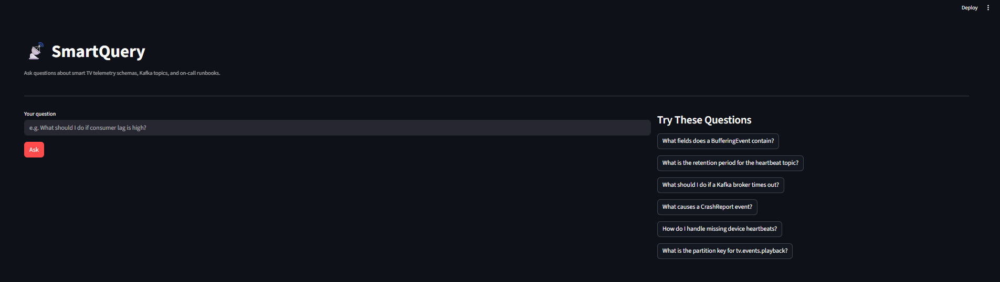
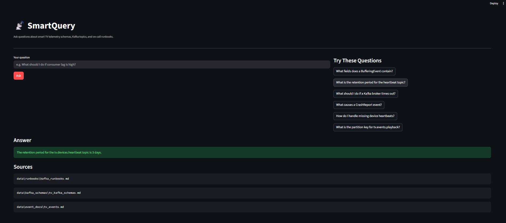
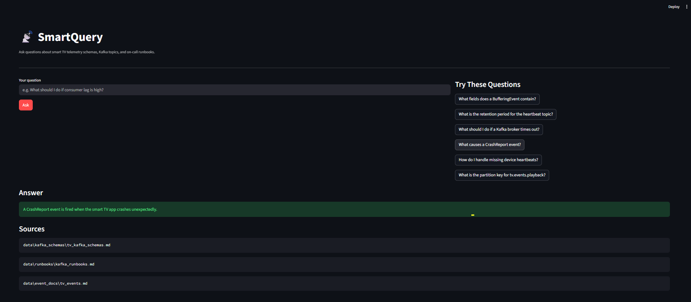

# SmartQuery — Telemetry Intelligence Assistant

A RAG-based assistant that lets engineers query smart TV telemetry schemas, 
Kafka event docs, and on-call runbooks in natural language.

Built with LangChain, ChromaDB, Groq (LLaMA 3.3), FastAPI, and Streamlit.





---

## Features

- Ask natural language questions about Kafka schemas and telemetry events
- Retrieves answers from a local vector knowledge base (ChromaDB)
- Cites the source document for every answer
- REST API with auto-generated docs at `/docs`
- Clean Streamlit UI with sample questions

---

## Tech Stack

| Layer        | Tool                          |
|--------------|-------------------------------|
| LLM          | LLaMA 3.3 via Groq API        |
| Vector DB    | ChromaDB                      |
| Embeddings   | all-MiniLM-L6-v2              |
| RAG          | LangChain                     |
| Backend      | FastAPI + Uvicorn             |
| Frontend     | Streamlit                     |
| Language     | Python 3.11                   |

---

## Project Structure
```
smartquery/
├── app.py                  # Streamlit UI
├── main.py                 # FastAPI backend
├── ingest/
│   └── loader.py           # Doc ingestion pipeline
├── retrieval/
│   └── query_engine.py     # RAG query engine
└── data/
    ├── event_docs/         # TV telemetry event docs
    ├── kafka_schemas/      # Kafka topic schemas
    └── runbooks/           # On-call runbooks
```

---

## Getting Started

### 1. Clone the repo
```bash
git clone https://github.com/Freny-S/smartquery.git
cd smartquery
```

### 2. Set up environment
```bash
python -m venv venv
source venv/bin/activate  # Windows: venv\Scripts\activate
pip install -r requirements.txt
```

### 3. Add your Groq API key
```
GROQ_API_KEY=your_key_here
```

### 4. Ingest documents
```bash
python ingest/loader.py
```

### 5. Run the backend
```bash
uvicorn main:app --reload
```

### 6. Run the UI
```bash
streamlit run app.py
```

Open `http://localhost:8501`

---

## API Endpoints

| Method | Endpoint  | Description                        |
|--------|-----------|------------------------------------|
| GET    | `/health` | Health check                       |
| POST   | `/query`  | Ask a natural language question    |

---

## Sample Output
```json
{
  "question": "What should I do if a Kafka broker times out?",
  "answer": "Check broker health in Kafka UI, verify network connectivity, check disk usage...",
  "sources": ["data/runbooks/kafka_runbooks.md"]
}
```